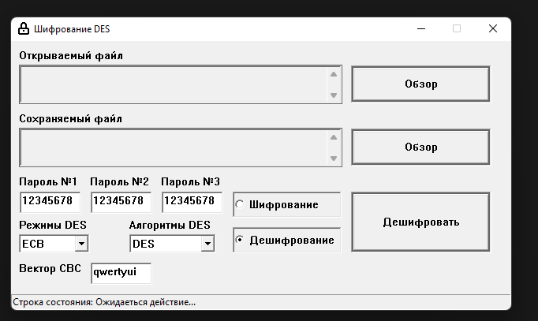

# DES/3DES with ECB and CBC (WinAPI) [LINK](./DES%20%D1%81%20CBC%20%D0%B8%203DES/)

# РЕНЗДЮ (WinAPI) [LINK](./%D0%A0%D1%8D%D0%BD%D0%B4%D0%B7%D1%8E//)

Настольная логическая игра для двух игроков, спортивный вариант крестиков-ноликов до пяти в ряд. [Подробнее](https://ru.wikipedia.org/wiki/Рэндзю#:~:text=Рэ́ндзю%20(яп.%20連珠)%20—%20настольная,название%2C%20также%20родились%20в%20Японии)

